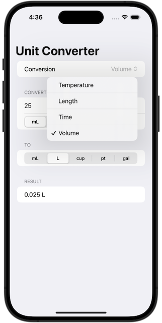
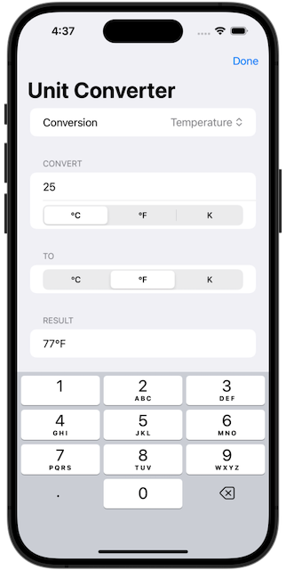

# Challenge Day: *Unit Converter*
https://www.hackingwithswift.com/100/swiftui/19
> Today you’re going to face your first challenge day, which is a day where you’re asked to build a completely new app from scratch using what you’ve learned so far.

## Challenge
> You need to build an app that handles unit conversions: users will select an input unit and an output unit, then enter a value, and see the output of the conversion.

## Screenshots
 
