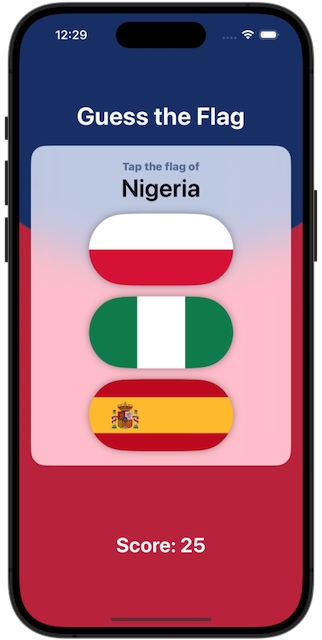
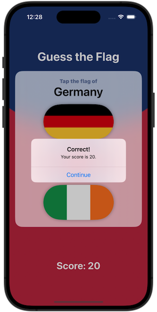
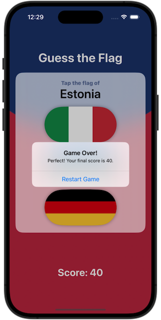

# Project 2: *Guess the Flag*
https://www.hackingwithswift.com/books/ios-swiftui/guess-the-flag-introduction
> This project is still going to be nice and easy, but gives me chance to introduce you to whole range of new SwiftUI functionality: stacks, buttons, images, alerts, asset catalogs, and more.

## Challenges
https://www.hackingwithswift.com/books/ios-swiftui/guess-the-flag-wrap-up
>1. Add an @State property to store the user’s score, modify it when they get an answer right or wrong, then display it in the alert and in the score label.
>2. When someone chooses the wrong flag, tell them their mistake in your alert message – something like “Wrong! That’s the flag of France,” for example.
>3. Make the game show only 8 questions, at which point they see a final alert judging their score and can restart the game.

## Screenshots
  
