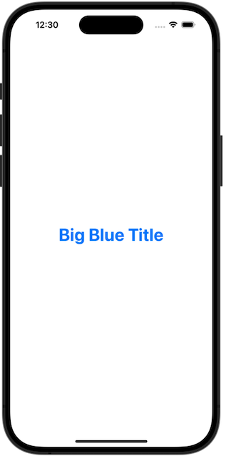
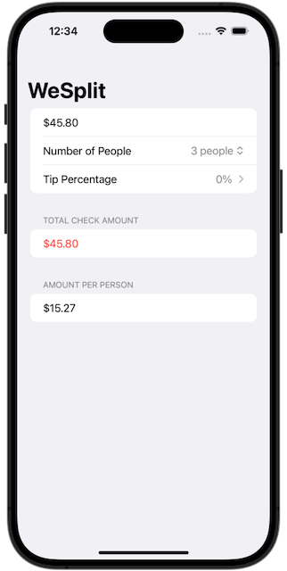

# Project 3: *Views and Modifiers*
https://www.hackingwithswift.com/books/ios-swiftui/views-and-modifiers-introduction
> In this technique project we’re going to take a close look at views and view modifiers, and hopefully answer some of the most common questions folks have at this point.

## Challenges
https://www.hackingwithswift.com/books/ios-swiftui/views-and-modifiers-wrap-up
>1. Go back to [project 1](https://github.com/cyberwool/100DaysOfSwiftUI/tree/main/01-Project01-WeSplit) and use a conditional modifier to change the total amount text view to red if the user selects a 0% tip.
>2. Go back to [project 2](https://github.com/cyberwool/100DaysOfSwiftUI/tree/main/03-Project02-GuessTheFlag) and replace the Image view used for flags with a new FlagImage() view that renders one flag image using the specific set of modifiers we had.
>3. Create a custom ViewModifier (and accompanying View extension) that makes a view have a large, blue font suitable for prominent titles in a view.

## Screenshots
 
