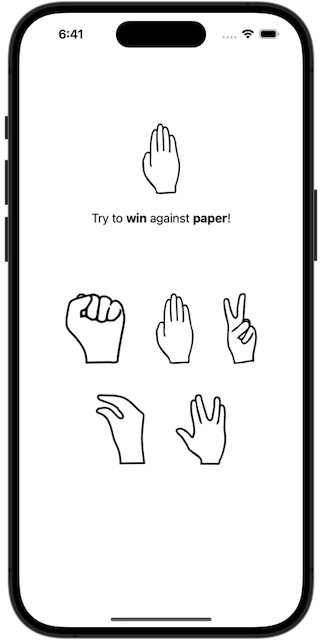
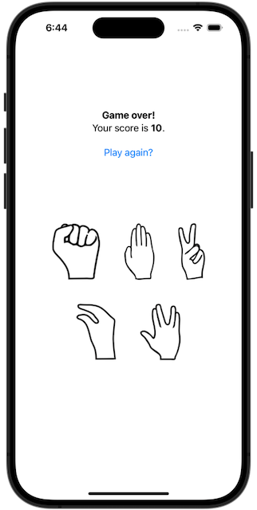

# Milestone 1: *Rock Paper Scissors*
https://www.hackingwithswift.com/guide/ios-swiftui/2/3/challenge

My version of this challenge has been modified to play ["Rock Paper Scissors Lizard Spock"](https://bigbangtheory.fandom.com/wiki/Rock,_Paper,_Scissors,_Lizard,_Spock).
Graphics used in the app courtesy of [alterlguest](https://favpng.com/png_view/scissors-rock-paper-scissors-rock-paper-scissors-lizard-spock-logo-png/2dL21Kbu).

## Challenges
>1. Each turn of the game the app will randomly pick either rock, paper, or scissors.
>2. Each turn the app will alternate between prompting the player to win or lose.
>3. The player must then tap the correct move to win or lose the game.
>4. If they are correct they score a point; otherwise they lose a point.
The game ends after 10 questions, at which point their score is shown.

## Screenshots
 
