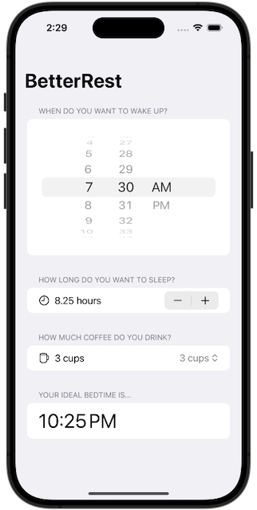

# Project 4: *BetterRest*
https://www.hackingwithswift.com/books/ios-swiftui/betterrest-introduction
> We’re starting a new project today, and we’re going to add some more SwiftUI skills to your collection while also tackling a fascinating area of programming: machine learning.

## Challenges
https://www.hackingwithswift.com/books/ios-swiftui/betterrest-wrap-up
>1. Replace each VStack in our form with a Section, where the text view is the title of the section. Do you prefer this layout or the VStack layout? It’s your app – you choose!
>2. Replace the “Number of cups” stepper with a Picker showing the same range of values.
>3. Change the user interface so that it always shows their recommended bedtime using a nice and large font. You should be able to remove the “Calculate” button entirely.

## Screenshot

