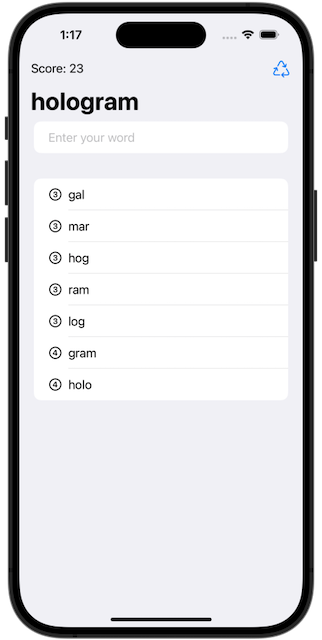
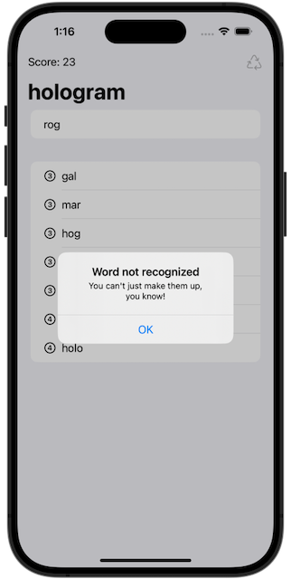

# Project 5: *Word Scramble*
https://www.hackingwithswift.com/books/ios-swiftui/word-scramble-introduction
> In this app you’ll work with two of the real fundamentals of app development: List for working with tables of data, and strings, for handling text.

## Challenges
https://www.hackingwithswift.com/books/ios-swiftui/word-scramble-wrap-up
>1. Disallow answers that are shorter than three letters or are just our start word.
>2. Add a toolbar button that calls startGame(), so users can restart with a new word whenever they want to.
>3. Put a text view somewhere so you can track and show the player’s score for a given root word. How you calculate score is down to you, but something involving number of words and their letter count would be reasonable.

## Screenshots
 
