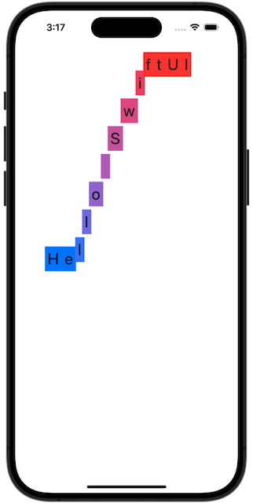
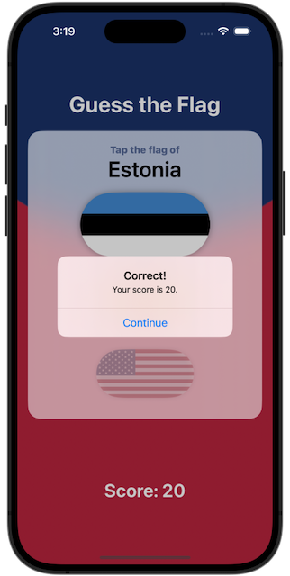

# Project 6: *Animations*
https://www.hackingwithswift.com/books/ios-swiftui/animation-introduction
> We’re back to another technique project, and this time we’re going to be looking at something fast, beautiful, and really under-valued: animations.

## Challenges
https://www.hackingwithswift.com/books/ios-swiftui/animation-wrap-up
>Go back to the [Guess the Flag](https://github.com/cyberwool/100DaysOfSwiftUI/tree/main/03-Project02-GuessTheFlag) project and add some animation:
>1. When you tap a flag, make it spin around 360 degrees on the Y axis.
>2. Make the other two buttons fade out to 25% opacity.
>3. Add a third effect of your choosing to the two flags the user didn’t choose – maybe make them scale down? Or flip in a different direction? Experiment!

## Screenshots
 
