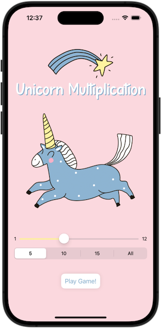
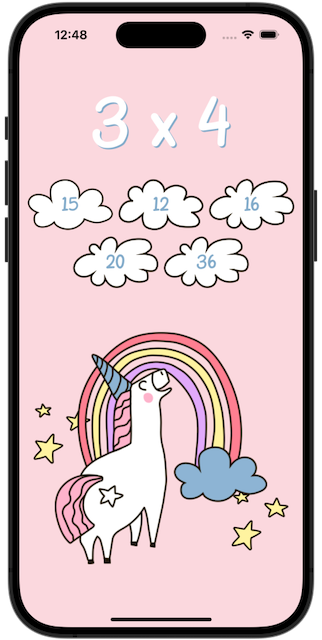
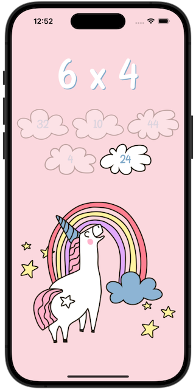
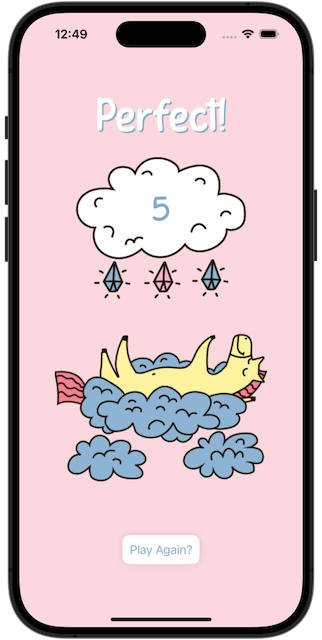

# Milestone 2: *Unicorn Multiplication*
https://www.hackingwithswift.com/guide/ios-swiftui/3/3/challenge

>Your goal is to build an “edutainment” app for kids to help them practice multiplication tables – “what is 7 x 8?” and so on. Edutainment apps are educational at their core, but ideally have enough playfulness about them to make kids want to play.

Features a pastel color palette and animated unicorns, stars, and clouds.
Unicorn imagery by [macrovector_official](https://www.freepik.com/free-vector/cute-unicorn-fairy-elements-colorful-doodle-set_10479097.htm), font "Papernotes" by [Letterflow](https://www.dafont.com/papernotes.font).

## Challenges
>1. The player needs to select which multiplication tables they want to practice. This could be pressing buttons, or it could be an “Up to…” stepper, going from 2 to 12.
>2. The player should be able to select how many questions they want to be asked: 5, 10, or 20.
>3. You should randomly generate as many questions as they asked for, within the difficulty range they asked for.

#### Followup Questions / Wishlist
- [ ] Font size, image scaling, and offsets that adapt better to various screen sizes
- [ ] Portrait orientation lock
- [ ] Sound effects

## Screenshots
   
