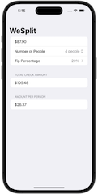
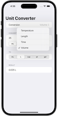
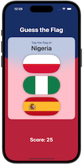

# 100 Days of SwiftUI
   

My solutions to projects, challenges, and milestones from the [100 Days of SwiftUI](https://www.hackingwithswift.com/100/swiftui) course by [Paul Hudson](https://github.com/twostraws).  I'm here to keep myself accountable, document my progress, and share the journey.

### 👀 Screenshots Included
Project directories also include screenshots of my completed work.

  

### 🚧 Course Progress
| | |
| :--- | :---: |
Projects w/ Challenges | 
Challenge Day | 
Milestone Projects | 
| | |

## 📋 Project List

### Starting SwiftUI
- [x] [Project 1: WeSplit](01-Project01-WeSplit) [Days 16-18]
- [x] [Challenge Day: Unit Converter](02-ChallengeDay-UnitConverter) [Day 19]
- [x] [Project 2: Guess the Flag](03-Project02-GuessTheFlag) [Days 20-22]
- [x] [Project 3: Views and Modifiers](04-Project03-ViewsAndModifiers) [Days 23-24]
### Consolidation II
- [ ] Milestone: Projects 1-3 [Day 25]

### Expanding Your Skills
- [ ] Project 4: BetterRest [Days 26-28]
- [ ] Project 5: Word Scramble [Days 29-31]
- [ ] Project 6: Animations [Days 32-34]
### Consolidation III
- [ ] Milestone: Projects 4-6 [Day 35]

### Scaling Up to Bigger Apps
- [ ] Project 7: iExpense [Days 36-38]
- [ ] Project 8: Moonshot [Days 39-42]
- [ ] Project 9: Navigation [Days 43-46]
### Consolidation IV
- [ ] Milestone: Projects 7-9 [Day 47]

### Focus on Data
- [ ] Project 10: Cupcake Corner [Days 49-52]
- [ ] Project 11: Bookworm [Days 53-56]
- [ ] Project 12: SwiftData [Days 57-59]
### Consolidation V
- [ ] Milestone: Projects 10-12 [Day 60-61]

### Views and View Controllers
- [ ] Project 13: Instafilter [Days 62-67]
- [ ] Project 14: Bucket List [Days 68-73]
- [ ] Project 15: Accessibility [Days 74-76]
### Consolidation VI
- [ ] Milestone: Projects 13-15 [Day 77-78]

### Controlling UI Flow
- [ ] Project 16: Hot Prospects [Days 79-85]
- [ ] Project 17: Flashzilla [Days 86- 1]
- [ ] Project 18: Layout and Geometry [Days 92-94]
### Consolidation VII
- [ ] Milestone: Projects 16-18 [Day 95]

### One Last Project
- [ ] Project 19: SnowSeeker [Days 96-99]
